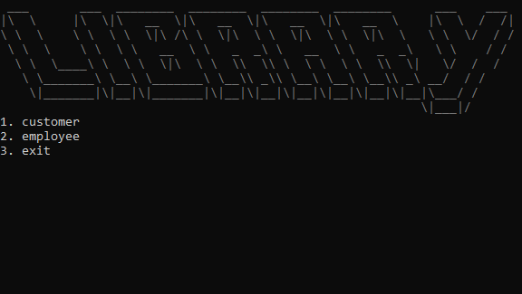
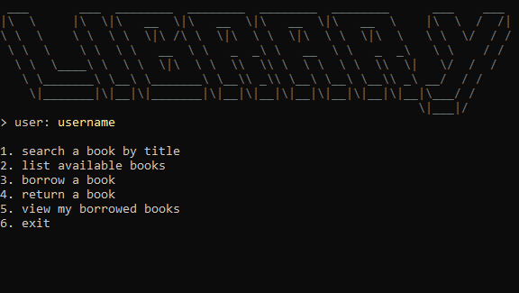
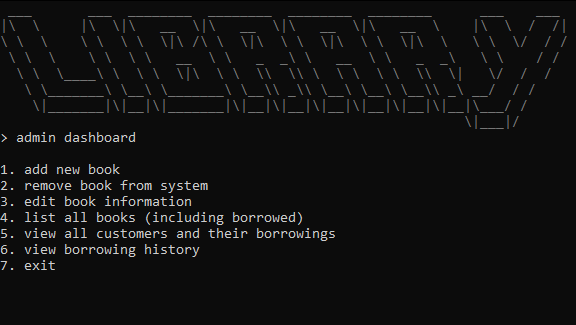

# 📚 Library 

> A simple **console-based Library Management System** built with **C#**.

## 📌 Note

A simple project made to improve my skills in **object-oriented programming**, **data handling**, and **CRUD logic** in a console app using C#.

## 💡 Features

- Distinct user roles: **Customer** and **Employee**
- Customer functions:
  - View available books
  - Borrow and return books
  - View personal borrowing history
- Employee dashboard:
  - Add, remove, and edit book details
  - View all books (including borrowed ones)
  - View all customers and their borrowings
  - Access borrowing history

## 🛠️ Built With

- C# (.NET)
- Console Application